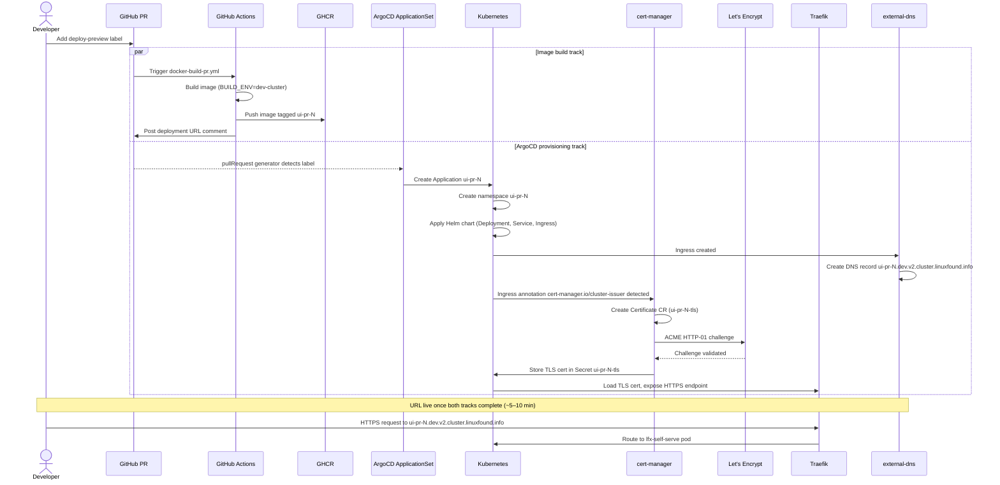

<!-- Copyright The Linux Foundation and each contributor to LFX. -->
<!-- SPDX-License-Identifier: MIT -->

# Deployment Architecture

## Overview

LFX One uses a GitOps deployment model. GitHub Actions builds and tags Docker
images; ArgoCD (in the `lfx-v2-argocd` sibling repo) reconciles those images
to the appropriate Kubernetes namespaces. There are three distinct deployment
paths, each triggered by a different git event.

```text
git event              workflow                   image tag          environment
─────────────────────────────────────────────────────────────────────────────────
push to main      →    docker-build-main.yml   →  development     →  dev cluster (persistent)
PR + label        →    docker-build-pr.yml     →  ui-pr-<N>       →  dev cluster (isolated namespace)
push v* tag       →    docker-build-tag.yml    →  <semver>        →  staging / production
```

## Build Environments

The Dockerfile accepts a `BUILD_ENV` argument that selects the Angular build
configuration. The mapping between workflow and build environment is:

| Workflow           | `BUILD_ENV`   | Angular config | Runtime backends (from Helm/ArgoCD values) |
| ------------------ | ------------- | -------------- | ------------------------------------------ |
| `docker-build-main` | `dev-cluster` | `dev-cluster`  | Shared dev Auth0 / API / NATS              |
| `docker-build-pr`   | `dev-cluster` | `dev-cluster`  | Shared dev Auth0 / API / NATS              |
| `docker-build-tag`  | `production`  | `production`   | Production Auth0 / API / NATS              |

`BUILD_ENV` selects the Angular compile-time configuration only — it does not
control which backends the running container connects to. Runtime backend URLs,
credentials, and feature flags come from Helm values and Kubernetes secrets
managed by ArgoCD in `lfx-v2-argocd`.

The `dev-cluster` Angular configuration is defined in
`apps/lfx-one/angular.json`.

## Workflow Details

### Main branch — persistent dev deployment

**Trigger:** push to `main`
**Workflow:** `.github/workflows/docker-build-main.yml`
**Image tag:** `development` (floating)

Every merged PR automatically rebuilds the image and ArgoCD rolls the dev
environment forward. No manual action required.

### PR branch preview — isolated namespace

**Trigger:** `deploy-preview` label added to an open PR
**Workflow:** `.github/workflows/docker-build-pr.yml`
**Image tag:** `ui-pr-<PR number>`

Builds an isolated preview for a single PR. ArgoCD provisions a dedicated
namespace (`ui-pr-<PR number>`) and the workflow bot posts the URL as a PR
comment:

```text
https://ui-pr-<PR number>.dev.v2.cluster.linuxfound.info
```

Removing the label or closing the PR triggers the cleanup job, which posts a
removal notice and ArgoCD tears down the namespace.

Full workflow details — including prerequisites, step-by-step instructions,
and troubleshooting — are in [CONTRIBUTING.md § Deploy Preview](../../CONTRIBUTING.md#deploy-preview).

#### Orchestration diagram

The label triggers two parallel tracks that must both complete before the URL
is reachable. Bot comment arrival (~5 min) signals the image is ready; the URL
becomes HTTPS-accessible once cert-manager finishes the Let's Encrypt challenge
(~5–10 min total).



### Release — staging and production

**Trigger:** push of a `v*` tag (e.g. `v1.0.42`)
**Workflow:** `.github/workflows/docker-build-tag.yml`
**Image tags:** semver (`1.0.42`, `1.0`)

The release workflow:

1. Builds the Docker image with `BUILD_ENV=production`.
2. Publishes the Helm chart to the OCI registry at
   `ghcr.io/linuxfoundation/lfx-self-serve/chart`.
3. Signs the chart with Cosign.
4. Generates a SLSA Level 3 provenance attestation.

ArgoCD in `lfx-v2-argocd` pins the chart version for staging and production
environments and promotes images through the standard GitOps promotion workflow.

## ArgoCD & GitOps

The `lfx-v2-argocd` sibling repo owns:

- Environment-specific Helm values (`values/dev/lfx-v2-ui.yaml`, staging, prod)
- Image tag pins and ApplicationSets for each environment
- ExternalSecret references for runtime configuration

This repo does not contain ArgoCD manifests — all promotion, rollback, and
environment management happens in `lfx-v2-argocd`.

## Container Registry

All images are pushed to the GitHub Container Registry (GHCR) under
`ghcr.io/linuxfoundation/lfx-self-serve`. Image visibility follows the
repository's package settings.

## Helm Chart

The chart source lives at `charts/lfx-self-serve/` in this repo. See
[charts/lfx-self-serve/README.md](../../charts/lfx-self-serve/README.md) for
parameter reference, values schema, and local installation instructions.
