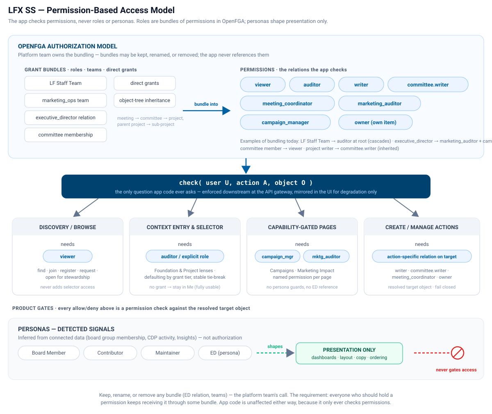

# Permission, Persona, and Navigation Model

Working spec for aligning how the LFX Self Serve experience in this repo decides where users can go, what they see, and what they can do. This document states the target model; for the code-verified current state of every guard, sidebar condition, and write path, see [`persona-content-matrix.md`](./persona-content-matrix.md).

## TL;DR

Separate the product model into four decisions:

- **Where can I go?** Outside of Me, `auditor` permission (direct or inherited via the model) is what's needed to browse into a Foundation/Project/Organization context. It's the only permission that matters for context entry: any higher permission (writer, owner) includes `auditor` by inheritance.
- **What is my persona there?** Persona shapes presentation — navigation, dashboards, sections, and metrics — never access.
- **What can I do there?** Each action checks the specific permission its API call requires against the target object. That's often `writer`, but not always — for example, meeting organizer, or the author-only edit rule on poll responses.
- **What can I discover?** Discovery surfaces let users find events, meetups, packages, projects, foundations, groups, and subscription surfaces outside their current contexts.

The key rule:

```text
Context access is not action authority.
Every gate is a permission check.
Personas shape presentation only.
Guards bind each action to the permission it requires.
```

## Core Principle

App code never branches on personas. Every gate is a permission check — can
user U do action A on object O. Guards define which permission each action
needs.

Personas (Board Member, Contributor, Maintainer, and the presentation use of
ED) are detected signals for shaping the experience only — not part of the
model, except that ED also happens to correspond to a real grant (see
Terminology and Model Asks below).

If a page or feature must exist for one audience only, that is a permission,
not a persona check: model it in OpenFGA, wire it into a guard (a Heimdall
RuleSet on the API route, plus a matching UI pre-check for early bail-out or
conditional nav/tab visibility).

Grants and the model are the platform team's domain — either may change at
any time; app code is unaffected because it only ever checks permissions.



## Terminology

Five terms, used precisely throughout this document and its companion matrix:

- **Model** — how OpenFGA evaluates relationships transitively across
  objects (e.g. writers of a project include the writers of that project's
  parent; writers of a committee include the writers of the committee's
  project). Owned by the platform team.
- **Grants** — a direct permission assignment: an OpenFGA tuple (e.g. "writer
  on CNCF"), including grants made via team membership or via another
  relation (e.g. `executive_director`).
- **Permissions** — the evaluated result of checking the model (e.g. "writer
  on Kubernetes, because writer on CNCF" — inherited, not a separate grant).
  This is what application code checks, via `check(user, action, object)`.
  Two read permissions matter across most of the product — **Viewer**
  (discoverability only: the thing exists and limited, often public, data
  is visible, but not its subordinate/connected objects; maps to Discovery)
  and **Auditor** (privileged read: full data on the object and its
  subordinate/connected objects; makes a Foundation or Project eligible for
  the selector and context entry). Other permissions are named for what
  they gate — `writer`, `committee.writer`, `meeting_coordinator`,
  `marketing_auditor`, `campaign_manager`, response-owner — see Writer
  Actions below.
- **Guards** — what binds a permission to a discrete action or surface:
  Heimdall RuleSets on API routes (the enforcement boundary) and UI route
  guards/affordance checks (degradation only, not the security boundary).
- **Personas** — any criteria outside the model (Board Member, Contributor,
  Maintainer, ED-as-persona), inferred from connected data. Presentation
  only; never a permission.

Legacy naming still in the app: UI copy labels the auditor permission
"Viewer" in at least one surface (Org Lens Access permission badges and
pickers) and "View" or "Review" elsewhere — this document uses "auditor"
regardless. The persona-detection service reads a `role` field off a
`cdp_roles` entry (legacy field name; not a permission).

## Current State

| Area                                                       | Status                  | Note                                                                                                                                                                                                                                                                                                                                                                                                                                                                        |
| ---------------------------------------------------------- | ----------------------- | --------------------------------------------------------------------------------------------------------------------------------------------------------------------------------------------------------------------------------------------------------------------------------------------------------------------------------------------------------------------------------------------------------------------------------------------------------------------------- |
| Me cross-context workspace                                 | Shipped                 | Default landing; My Foundations and Projects bridges into Foundation/Project context; cross-context filters (All Foundations/Projects/Groups/Roles/Statuses/Types — "Roles" is legacy UI copy, not a permission)                                                                                                                                                                                                                                                            |
| Foundation/Project writer actions                          | Shipped                 | Create Meeting/Group/Vote/Survey/Newsletter, mailing list, document, and Permissions actions exposed inline                                                                                                                                                                                                                                                                                                                                                                 |
| Discovery                                                  | Shipped (partial)       | Discover Events exists; Akrites is the strongest pattern (browse → inspect → Open for stewardship)                                                                                                                                                                                                                                                                                                                                                                          |
| Lens access from writer grants                             | Shipped                 | PR #1130 (derived from writer grants, not persona alone); create picker is a lazy direct-grant tree with search (PR #1193)                                                                                                                                                                                                                                                                                                                                                  |
| "What can I create" backend API                            | Discarded               | LFXV2-2753 rescoped after #1130 shipped; ticket status Discarded, no replacement work item                                                                                                                                                                                                                                                                                                                                                                                  |
| ED fast path in `writerGuard`/`newsletter-access.guard.ts` | Needs verification (P0) | Skips the permission check for ED persona on meetings/votes/surveys/mailing lists/newsletters/document routes. Does not grant the write itself — API enforcement is separate, and `executive_director` does not inherit project `writer`. Very likely a guard bug (a misleading UI-only affordance a downstream write would reject), not a permission the model grants. Whether it's a confusing dead-end or an actual gap depends on independent API enforcement — see P0. |
| `marketing_auditor` / `campaign_manager` via ED            | Real, but undocumented  | Two intentional marketing permissions the live model (`model.fga`) grants through `executive_director`; `PERMISSIONS.md`'s rendered Project table omits them, making ED look read-only when it isn't                                                                                                                                                                                                                                                                        |
| Left rail label                                            | Bug                     | Says "Projects" even when a foundation is selected                                                                                                                                                                                                                                                                                                                                                                                                                          |
| Me nav labels                                              | Bug                     | Repeat the "My" prefix redundantly under the Me lens                                                                                                                                                                                                                                                                                                                                                                                                                        |
| Foundation/Project defaulting                              | Risk                    | Can land in a no-grant context if selector eligibility isn't authoritative                                                                                                                                                                                                                                                                                                                                                                                                  |
| Discovery/selector separation                              | Risk                    | Discovery contexts can bleed into the Foundation/Project selector                                                                                                                                                                                                                                                                                                                                                                                                           |

## Target Model

### Me Lens

Me is the user's cross-context workspace.

It should support:

- task switching across contexts
- pending actions
- cross-context meetings, events, groups, votes, surveys, documents, mailing lists, and newsletters
- discovery entry points
- direct jumps into Foundation/Project context

Me pages can support actions when the target context is known. The resolved
target object is always the authority for its action-specific permission
check — Me is an action workspace, not the authorization context:

```text
Me item or create action + resolved target object (project, foundation, committee, group)
+ the action-specific permission on that object = allowed create/manage action
```

The target is usually Foundation/Project and the permission is `writer`, but
that's the common case, not the only one. The shipped create flow (PR #1193)
also resolves committee/group targets for meetings, surveys, and votes:
`writerGuard` accepts `committee.writer` for those three features when a
`committee_uid` is present, and accepts `project.meeting_coordinator` for
meetings specifically, independent of `project.writer`. A committee writer
or meeting coordinator can legitimately hold no direct project-level
auditor/writer grant.

Examples:

- **Pending agenda action:** resolve the target group/project/foundation; allow agenda management only if writer permission applies.
- **Meeting card:** open the meeting with its context; edit/manage only if writer permission applies.
- **Vote or survey:** open the item; view/results follow viewer/discoverable eligibility for that item, edit/close follows writer permission.
- **Document row:** open the document context; upload/folder/link actions follow writer permission.
- **Newsletter draft:** open the draft with its target audience context; edit/delete/send follows writer permission for that context.
- **Newsletter create:** ask for the target Foundation/Project and audience first; then apply writer permission.
- **Akrites package:** open package drawer/workflow; stewardship follows Akrites request/stewardship rules.

### Foundation And Project Contexts

Foundation and Project are context views, not persona rewards. Entry
requires an authoritative permission grant; once inside, persona shapes the
presentation.

Persona pairs — presentation only, except where noted:

- **Executive Director** in Foundation context maps to **Maintainer** in Project context presentation. Both are context-operator-shaped experiences. They can create/manage only when writer permission is present.
- **Board Member** in Foundation context maps to **Contributor** in Project context presentation. Both are context-participant-shaped experiences. They do not automatically receive create/manage authority.

Of these four, only ED is backed by a real grant in the model (see
Terminology and Model Asks for what it currently feeds). Board Member,
Contributor, and Maintainer are inferred/dynamic presentation signals
detected from connected data (board group membership, CDP activity/
`cdp_roles`, Insights) — "maintainer," for instance, is a value the
persona-detection service reads off a `cdp_roles` entry's `role` field
(legacy naming), a real value in its _source_ system but not a permission
on Project or Foundation. None of the three exist as a permission on
Project or Foundation.

Participant personas (Board Member, Contributor) are presentation-only.
Foundation/Project context entry always requires auditor or another
explicit permission for that exact context, independent of persona — a
user without one does not see Foundation/Project navigation at all; their
experience is Me, where their own items, meetings, votes, and documents
remain fully usable via item-level eligibility (see Me Lens above). ED is
not a synonym for every privileged action, and Maintainer is not a lesser
product concept than ED — they are parallel presentation concepts for
different context types, but only ED corresponds to any grant today.

### Writer Actions

Do not introduce a separate Admin Mode for Foundation/Project create/manage
authority — that would imply EDs, Board Members, Maintainers, or
Contributors get a privileged write view because of persona alone.

LF Staff Mode is a distinct, still-open product question, not a settled
requirement. LF Staff already gets `auditor` on every project and
foundation through LF Staff Team inheritance (see Model Asks below) — the
same broad read access a privileged community member would get with an
explicit `auditor` grant on a given foundation. What would "LF Staff Mode"
add beyond that? The only candidate that survives the question is
write-side — assisted workflows where staff act _on behalf of_ a user or
foundation for support/troubleshooting (e.g., fixing a broken meeting or
mailing list), which no read permission grants and which a community
member's `auditor` grant would not extend to at any scale. Until product
defines what, if anything, LF Staff Mode adds, treat it as undefined — and
it should not replace contextual writer permission for normal
Foundation/Project create/manage actions in the meantime.

Keep create/manage actions inline where they belong:

- Create Meeting
- Create Group
- Add Mailing List
- Create Newsletter
- Create Vote
- Create Survey
- Upload File / New Folder / Add Link
- Add User / update permission / remove user
- edit, delete, duplicate, assign, manage resources, invite/add people, send/publish

Rule:

```text
Selected Foundation/Project context + writer permission = create/manage affordances
No writer permission = read-only context experience
```

Target-state guard change:

```text
Current writerGuard = Executive Director fast path or canWrite()
Target writerGuard = resolved target context + canWrite()
```

ED-shaped pages gate on the existing named permissions — checked like any
other permission, never on a persona guard and never by branching on the
`executive_director` grant from application code:

- **Campaigns** checks `campaign_manager` (write-capable; the model currently feeds it from `executive_director` and the `marketing_ops` team).
- **Marketing Impact** checks `marketing_auditor` (read-only; the model currently feeds it from `executive_director`, `marketing_ops`, and parent-project inheritance).
- **Health Metrics** stays ED-gated by design — this page does not migrate to a shared permission (LFXV2-2726 is evaluating an LF Staff answer, not yet started; see also the open Paul/Jim question in Model Asks).

None of these three needs a new permission invented for it — all three
already exist in the model. This migration is tracked in LFXV2-2236 ("Add
Marketing Ops UI access (FGA guards)," in review as of this writing) —
today, all three pages on `main` still gate solely on
`executiveDirectorGuard` (a pure persona check with no permission lookup).
Until that ticket merges, treat Current State above as describing the
actual state, not this target state.

Whether the `executive_director` grant itself stays in the model, is
renamed, or is fed differently is the platform team's call, not the app's
(see Model Asks below) — the app checks `marketing_auditor` and
`campaign_manager` directly and does not care what feeds them. Create/
edit/manage routes should not use ED as an authorization shortcut unless
the user also has writer permission for the selected target context.

If LF Staff Mode ends up needing to exist as a distinct concept, it should
have its own explicit staff eligibility and audit expectations, and should
not be inferred from ED, Board Member, Maintainer, Contributor, or writer
permission.

### Discovery

Discovery is for finding things outside the user's current contexts. It
should create requests, registrations, subscriptions, or workflows, but it
should not silently add the context to the Foundation/Project selector
unless auditor or another explicit permission exists.

```text
Selector = contexts where I have auditor or another explicit permission
Discovery/Browse = contexts or resources I can find, join, register for, request, or inspect
```

Akrites is the clearest example:

```text
Browse packages -> inspect risk/health/provenance -> Open for stewardship
```

Other discovery examples:

- **Events:** find events I am not registered for; register or view details.
- **Meetups:** find community meetups I have not joined; join/register or view details.
- **Akrites:** find packages needing stewardship; open for stewardship.
- **Projects:** find projects/foundations I am not active in; follow, join, request access, or view public profile.
- **Groups:** find public/community groups; join, request membership, or view group details.
- **Mailing lists/newsletters:** find public subscription surfaces; subscribe, request access, or view public archive when available.

## Priorities

### P0: Make Permission Resolution Authoritative

Owner: engineering, with product validation

This is the dependency under selector eligibility, defaulting, writer actions, and discovery separation.

Work needed:

- Normalize one permission model across Foundation, Project, Group, and Working Group resources.
- Confirm selector candidates come only from auditor or another explicit permission, not broad discovery/search results.
- Confirm APIs enforce auditor and write permission server side before changing `writerGuard` semantics.
- Model group-scoped and working-group-scoped writer permission this cycle.
- Define one permission label per context everywhere the selector, page header, and badges are shown.
- Add instrumentation for wrong-context landings, no-grant defaults, selector items without grants, and UI-allowed/API-denied write attempts.

Acceptance:

```text
Authoritative permission model = selector eligibility
Discovery/search results != selector eligibility
Group/WG writer scope = explicit model, not foundation-wide fallback
No-grant default count = zero
```

Downstream API write enforcement per managed domain is tracked in
[LFXV2-1662](https://linuxfoundation.atlassian.net/browse/LFXV2-1662)
(enforcement lives at the API gateway, external to the UI, since those APIs
serve consumers other than the app); resolve that before changing
`writerGuard` semantics. `writerGuard` is UI degradation, not the security
boundary — it should not be treated as a blocking gate on its own.

### P1: Preserve My Dashboard As The Context Bridge

Owner: UX / Nuno

What exists:

- My Dashboard already has **My Foundations and Projects**.
- Selecting a row already acts as a bridge into the selected Foundation/Project context.

Work needed:

- Make this bridge obvious and intentional in UX.
- Confirm Foundation rows switch to Foundation context and select the foundation.
- Confirm Project rows switch to Project context and select the project.
- Keep row labels clear about type and permission.

Acceptance:

```text
My Foundations and Projects row + selected context = switch to correct context view
```

### P2: Persist Last Valid Context, Then Default By Permission

When a user clicks Foundation or Project context without selecting a specific row, use the last selected valid context first. Highest-permission defaulting is only the cold-start fallback.

Each tier below can contain more than one candidate; the stable sort order is
the tie-breaker _within_ a tier, not a separate tier of its own — API
ordering must never change which context gets selected.

Foundation defaulting order:

1. Keep existing selected foundation if still permission-eligible.
2. Use last selected valid foundation if still permission-eligible.
3. Choose a foundation with writer permission; if more than one qualifies, pick the first in stable sort order.
4. Otherwise, choose a foundation with auditor or another explicit permission; if more than one qualifies, pick the first in stable sort order.
5. If none exist, stay in Me/discovery.

Project defaulting order:

1. Keep existing selected project if still permission-eligible.
2. Use last selected valid project if still permission-eligible.
3. Choose a project with writer permission; if more than one qualifies, pick the first in stable sort order.
4. Otherwise, choose a project with auditor or another explicit permission; if more than one qualifies, pick the first in stable sort order.
5. If none exist, stay in Me/discovery.

Examples:

- User last selected AAIF and is still permission-eligible: Foundation lands on AAIF, even if another foundation has a higher permission.
- User last selected `Goose` and is still permission-eligible: Project lands on `Goose`, even if another project has writer permission.
- Cold start, writer permission on AAIF and auditor permission on LF Europe, no other permissions: Foundation lands on AAIF because writer wins.
- Cold start, auditor permission on AAIF and CNCF only, no writer permission anywhere: Foundation lands on first stable auditor-eligible foundation.
- Cold start, writer permission on LF Products, no other foundation permission: Foundation lands on LF Products.
- Cold start, writer permission on `agentgateway` and auditor permission on `Goose`: Project lands on `agentgateway` because writer wins.
- Cold start, auditor permission on six projects, no writer permission anywhere: Project lands on first stable auditor-eligible project.
- Cold start, writer permission on `Goose` only: Project lands on `Goose`.
- Cold start, writer permission on both `agentgateway` and `Goose`, no other permissions: Project lands on whichever of the two sorts first in stable order — never on API response order.
- User opens AAIF from My Dashboard: explicit selection wins; switch to Foundation context with AAIF selected.
- User opens `agentgateway` from selector: explicit selection wins; switch to Project context with `agentgateway` selected.
- User loses their permission for selected AAIF mid-session: clear AAIF and re-run defaulting.
- User has no permission-eligible foundations: do not enter empty Foundation context; stay in Me/discovery.
- User has no auditor or other explicit permission for EnerGNN: never default to EnerGNN; show it only in Discovery/Browse if discoverable.

Acceptance:

```text
Candidate contexts + auditor or another explicit permission = selector items
Context click + last valid selection = selected context
Cold start + highest-permission fallback = selected context
No-grant context = never selected by default
Explicit selection always wins over defaulting
```

### P3: Keep Writer Actions Contextual

Work needed:

- Inventory every create/manage affordance in Foundation/Project pages.
- Confirm each affordance is gated by contextual writer permission.
- Confirm direct create/edit/admin routes are guarded.
- Confirm backend/downstream writes remain authoritative.
- Confirm Me-originated actions resolve target context before applying writer checks.
- Include Meetings, Groups, Mailing Lists, Newsletters, Votes, Surveys, Documents, and Permissions in the inventory.
- Add regression tests for read-only users who can view a context but cannot see create/manage affordances, and for working group chairs who can manage group-level meetings/documents without receiving foundation-wide affordances.

Acceptance:

```text
Selected Foundation/Project context + writer permission = create/manage affordance visible/enabled
Selected Foundation/Project context + no writer permission = read-only context experience
Me-originated task + target context + writer permission = allowed action
Me create action + selected target context + writer permission = allowed action
```

Regression cases:

- ED/Maintainer with writer permission sees create/manage actions.
- Board Member/Contributor without writer permission does not see create/manage actions.
- User with writer permission but unexpected/no persona signal still sees create/manage actions for that context.
- User who loses writer permission mid-session loses or disables create/manage affordances.
- Direct edit route without writer permission fails closed or redirects.

### P4: Refine Me Navigation Naming

Do this after P1-P3 are settled.

Because the active lens already says **Me**, repeated `My` prefixes are unnecessary.

Recommended label changes:

- My Dashboard -> Dashboard
- My Meetings -> Meetings
- My Events -> Events
- My Meetups -> Meetups
- My Groups -> Groups
- My Mailing Lists -> Mailing Lists
- My Votes -> Votes
- My Surveys -> Surveys
- My Documents -> Documents
- My Newsletters -> Newsletters, if Newsletters appears in Me navigation

Acceptance:

```text
Me nav labels = task nouns
```

### P5: Expand Discovery As Explicit Browse/Join Paths

Work needed:

- Keep discovery separate from Foundation/Project selector eligibility.
- Move no-grant and public discoverable contexts out of the selector and into Browse/Discovery.
- Use explicit user actions such as register, join, follow, request access, subscribe, or open for stewardship.
- Do not silently add discovered contexts to selectors until auditor or another explicit permission exists.

Acceptance:

```text
Discovery = find something outside current access
Discovery action = explicit request/registration/subscription/workflow
```

## Model Asks (Platform Team)

1. **`executive_director` stays as a grant in the model — resolved.** The
   app checks `auditor`, `writer`, `marketing_auditor`, and
   `campaign_manager` directly and never branches on the
   `executive_director` grant itself (see Writer Actions above). Per Eric
   Searcy's review, it stays rather than being removed or replaced — it
   remains the grant that feeds `auditor`, `marketing_auditor`, and
   `campaign_manager` for EDs, including the one non-staff ED for whom
   `marketing_auditor`/`campaign_manager` aren't available through any
   other path.

2. **Org lens for LF staff — outcome tracked as LFXV2-2936; implementation
   proposal is [LFXV2-2937](https://linuxfoundation.atlassian.net/browse/LFXV2-2937).**
   What the app needs is an outcome, not a mechanism: LF staff resolve
   `auditor` (and the support team resolves writer-level access, where
   applicable) on each B2B Organization through the normal access check.
   Unlike projects, B2B orgs have no common root/ancestor, so the
   project-style root-cascade inheritance does not apply. Per OpenFGA's
   system-hierarchy guidance, globally-applied org access is modeled as
   per-object grants from a non-recursive system hierarchy, with distinct
   relations for global auditors (all LF staff) and global writers
   (support team) — Eric Searcy's LFXV2-2937, which supersedes 2936's
   suggested mechanism (same objective, different implementation). Either
   way: a model change, not a UI workaround, and app code is unaffected —
   it only ever checks the permission on the org object.

3. **Health Metrics access for non-ED writers — open question, posed to
   Eric Searcy, not yet resolved.** Writer permission on a context should
   surface everything about it, including Health Metrics — today the page
   is ED-gated by design (see Writer Actions above), which strands a
   non-ED writer from a page their writer permission would otherwise
   imply. Two ways to close that gap: either `writer` starts feeding
   `marketing_auditor` in the model, or the Health Metrics guard accepts
   `writer` OR `marketing_auditor` instead of `marketing_auditor` alone.
   Awaiting Eric's pick — not resolved unilaterally here.

## Contract Summary

This is the contract this document proposes. Review/approval on the PR is the agreement mechanism.

```text
Authoritative permission model -> selector eligibility and defaulting
Context selector eligibility -> auditor or another explicit permission
Sidebar/page/content visibility -> persona (presentation only)
Action authority -> existing contextual writer permission
Campaigns/Marketing Impact -> named permission (campaign_manager/marketing_auditor), not ED persona
Health Metrics -> stays ED-gated by design, pending an LF Staff answer (LFXV2-2726) and the writer/marketing_auditor question above
Me-originated actions -> carry target context before writer checks
Discovery -> explicit browse/join/request workflows
No separate Admin Mode for Foundation/Project create/manage authority
LF Staff Mode -> open product question, not a decided requirement (LF Staff already has broad auditor via team inheritance)
No-grant contexts -> Browse/Discovery only, never default selection
```
