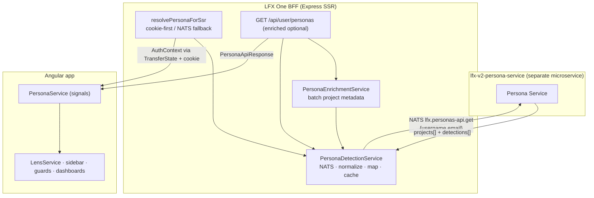

<!-- Copyright The Linux Foundation and each contributor to LFX. -->
<!-- SPDX-License-Identifier: MIT -->

# Persona Detection Pipeline

How a user's involvement across Linux Foundation projects becomes the four `PersonaType` values this UI reacts to. This doc traces the full path: the upstream `lfx-v2-persona-service` NATS contract → the BFF detection/enrichment services → the hydrated frontend signals.

For how those personas are then consumed by lenses, navigation, and guards, see [Lens & Persona System](./lens-system.md) and the [Persona × Lens Content Matrix](./persona-content-matrix.md). This doc is upstream of both — it explains where personas come from in the first place.

## Personas are not authorization

The upstream service name is deliberate: **personas describe how to present context to a user, not whether they may access something.** A persona shapes sidebar links, dashboard variants, and default scope. It is never the authority for a write/manage action — that stays with the access-check layer (`canWrite()`, route guards, and upstream microservice enforcement). See [Permission, Persona, and Navigation Model](./permission-persona-navigation-model-preread.md) for the view / persona / manage separation.

## The four personas

```typescript
// packages/shared/src/interfaces/persona.interface.ts
type PersonaType = 'contributor' | 'maintainer' | 'board-member' | 'executive-director';
```

A user can hold **multiple personas at once** (e.g. a maintainer on one project who is also a board member of a foundation). Priority order, highest first:

```typescript
// packages/shared/src/constants/persona.constants.ts
const PERSONA_PRIORITY = ['executive-director', 'board-member', 'maintainer', 'contributor'];
```

Personas are also grouped by scope, which drives lens gating downstream:

| Set                       | Members                              | Drives             |
| ------------------------- | ------------------------------------ | ------------------ |
| `BOARD_SCOPED_PERSONAS`   | `board-member`, `executive-director` | `foundation` lens  |
| `PROJECT_SCOPED_PERSONAS` | `maintainer`, `contributor`          | `project` lens     |

## Upstream contract — `lfx-v2-persona-service`

Persona detection is **owned by a separate microservice** ([`lfx-v2-persona-service`](https://github.com/linuxfoundation/lfx-v2-persona-service)). This repo is its only consumer. The service aggregates a user's engagement across many backend systems (Query Service, CDP, committees, mailing lists, meetings) into one UI-friendly payload, so the UI doesn't fan out to those systems on every page load.

The contract is a **NATS request/reply**, not REST:

| Property      | Value                                       |
| ------------- | ------------------------------------------- |
| Subject       | `lfx.personas-api.get` (`NatsSubjects.PERSONAS_GET`) |
| Request       | `{ "username": "jdoe", "email": "jdoe@example.com" }` |
| Timeout       | 5 s (set in `fetchPersonaDetections`)       |

`email` is the primary identity signal; `username` unlocks additional matching legs upstream and may be empty. The response is one entry per project, each carrying one or more **detections** describing *why* the project is relevant:

```jsonc
{
  "projects": [
    {
      "project_uid": "a1b2c3d4-...",
      "project_slug": "my-project",
      "detections": [
        { "source": "board_member", "extra": { "committee_name": "TAC", "role": "Chair", "organization": { "id": "...", "name": "The Linux Foundation" } } },
        { "source": "cdp_roles", "extra": { "contributionCount": 42, "roles": [{ "role": "Maintainer", "repoUrl": "..." }] } },
        { "source": "mailing_list" }
      ]
    }
  ],
  "error": null
}
```

### Detection source tokens

The upstream service emits these `detections[].source` tokens. The UI is responsible for interpreting them — the service passes data through without deciding what persona it implies.

| Token                | Meaning (upstream)                                          |
| -------------------- | ---------------------------------------------------------- |
| `board_member`       | Member of a `Board`-category committee                     |
| `executive_director` | Executive Director of the project                          |
| `cdp_roles`          | CDP project affiliation — carries `roles[]` + `contributionCount` |
| `cdp_activity`       | CDP/Snowflake activity signal *(reserved upstream; not yet emitted)* |
| `writer`             | Project writer (access-control membership)                 |
| `auditor`            | Project auditor (access-control membership)                |
| `committee_member`   | Member of any committee (community engagement signal)      |
| `mailing_list`       | Subscribed to a project mailing list                       |
| `meeting_attendance` | Invited to or attended a project meeting                   |

A single project may carry multiple detections, and the same token may repeat (e.g. two Board committees → two `board_member` detections). Board-category members appear in **both** `board_member` and `committee_member`.

## BFF pipeline

Two server services own persona resolution, both exported as singletons from `apps/lfx-one/src/server/utils/persona-helper.ts`:

- **`PersonaDetectionService`** — calls NATS, maps detections to personas, applies overrides, caches.
- **`PersonaEnrichmentService`** — wraps detection and batches project metadata (name/logo/parent/foundation flag).

### 1. Identity resolution

`getPersonas(req)` derives the request payload from the **effective identity** (`apps/lfx-one/src/server/utils/auth-helper.ts`):

- `getEffectiveUsername(req)` — impersonation target's username if impersonating, else the OIDC `nickname` / `username` / `preferred_username`.
- `getEffectiveEmail(req)` — impersonation target's email if impersonating, else the OIDC `email`, **lowercased**.

Because these are impersonation-aware, persona detection automatically reflects the impersonated user. See [Impersonation](../backend/impersonation.md).

### 2. NATS call and normalization

`fetchPersonaDetections` issues the NATS request, then **normalizes defensively** before any consumer sees it:

- Missing/malformed fields are coerced to safe defaults (empty strings / arrays).
- The **ROOT (tenant root) project is stripped** from the response, so the personas map, persona list, affiliated slugs, and organizations are all ROOT-free.
- On NATS failure it returns `{ projects: [], error: { code: 'nats_error', ... } }` so callers degrade gracefully instead of throwing.

### 3. Detection → persona mapping

`mapDetectionsToPersonas` converts each project's detections into a `PersonaType[]`:

```typescript
// apps/lfx-one/src/server/services/persona-detection.service.ts (logic summary)
const DETECTION_SOURCE_MAP = {
  board_member: 'board-member',
  executive_director: 'executive-director',
};
```

Rules, in order:

1. `board_member` → `board-member`; `executive_director` → `executive-director` (via `DETECTION_SOURCE_MAP`).
2. `cdp_roles` whose `extra.roles[]` contains a role equal to `'maintainer'` (case-insensitive) → `maintainer`.
3. **Every other detection** — `writer`, `auditor`, `committee_member`, `mailing_list`, `meeting_attendance`, a non-maintainer `cdp_roles`, or any unknown token → `contributor`.
4. If a project produced no personas, it defaults to `contributor`.
5. `contributor` is dropped **only when `maintainer` is also present** for that project (maintainer is the true upgrade of the same project-scoped domain). `board-member` / `executive-director` are orthogonal foundation roles and never cause `contributor` to be dropped.

The per-request persona list is then `collectUniquePersonas` — the union of every project's personas, filtered through `PERSONA_PRIORITY` so the order is stable and the first element is the highest-priority "primary" persona.

> **Note:** detection tokens map many-to-one onto personas. `writer`, `auditor`, `committee_member`, `mailing_list`, and `meeting_attendance` all currently resolve to `contributor` — they are engagement signals, not distinct UI personas.

### 4. Request-scoped overrides

Two overrides are applied **per request, after the cached detection result**, so they are never baked into the shared cache:

- **Root writer injection** — `checkRootWriter(req)` does an independent NATS lookup (`PROJECT_SLUG_TO_UID` for the `ROOT` slug + an access check). A writer on the tenant root project is force-promoted to `executive-director` (moved to the front of the list) and flagged `isRootWriter: true`. This is the only path that injects a persona the user doesn't natively hold.
- **Impersonation persona context** — `req.appSession.impersonationPersonaContext` is honored **only if the target user actually holds that persona**, so impersonation can't escalate scope.

### 5. Organizations

`extractOrganizations` reads `extra.organization` from `board_member` detections and de-dupes by org id, producing the `Account[]` used to seed the org/account context.

### 6. Caching

| Cache                          | TTL    | Key                      |
| ------------------------------ | ------ | ------------------------ |
| Persona detection result       | 15 s (`PERSONAS_CACHE_TTL_MS`) | `username \|\| email` |
| Affiliated project slugs        | 15 s (`AFFILIATED_PROJECT_UIDS_CACHE_TTL_MS`) | `username \|\| email` |
| ROOT project UID                | 1 h (`ROOT_PROJECT_UID_CACHE_TTL_MS`) | global |

Caches store the **in-flight Promise** so concurrent callers share one NATS round-trip. Failed lookups (or results carrying an `error`) are evicted immediately so the next caller retries. When there is no stable identifier (no username and no email), the cache is bypassed entirely to prevent cross-user leaks. A background sweep evicts expired entries every 60 s.

### 7. Enrichment

`PersonaEnrichmentService.getEnrichedPersonas(req)` runs detection, then makes a **single batched** project-service call (`getProjectsByIds`) keyed by project UID to attach `projectName`, `logoUrl`, `parentProjectUid`, `description`, and `isFoundation`. On upstream error or empty projects it returns the base (un-enriched) response unchanged.

## API endpoints

One route serves both shapes (`apps/lfx-one/src/server/routes/persona.route.ts` → `PersonaController`):

| Endpoint                              | Returns                                                       |
| ------------------------------------- | ------------------------------------------------------------ |
| `GET /api/user/personas`              | Raw detection (`PersonaApiResponse`) — `projectName`, `logoUrl`, `parentProjectUid`, and `description` null; `isFoundation` defaults to `false` |
| `GET /api/user/personas?enriched=true`| Same, with project metadata batch-resolved                   |

The `PersonaApiResponse` payload:

```typescript
// packages/shared/src/interfaces/persona-detection.interface.ts
interface PersonaApiResponse {
  personas: PersonaType[];                                   // priority-ordered, primary first
  personaProjects: Partial<Record<PersonaType, PersonaProject[]>>;
  projects: EnrichedPersonaProject[];                        // detections + mapped personas per project
  organizations: Account[];
  isRootWriter: boolean;                                     // request-scoped, not cached
  error: string | null;
}
```

## SSR, cookie, and hydration

1. **SSR** — `resolvePersonaForSsr(req, res)` is cookie-first: if the `lfx-active-persona-preset` cookie (`PERSONA_COOKIE_KEY`) is present it reads persona + organizations from it (non-blocking); otherwise it calls NATS, then writes a 30-day cookie (unless detection errored, so a transient NATS failure doesn't pin the user to `contributor`). The result seeds `AuthContext` (`persona`, `personas`, `organizations`, `projects`, `personaProjects`).
2. **Hydration** — `AuthContext` crosses to the browser via Angular `TransferState` (key `auth`). `PersonaService` initializes its signals from it.
3. **Refresh** — on first render `PersonaService.refreshFromApi()` hits `/api/user/personas`; `refreshEnrichedPersonas()` lazily hits `?enriched=true` once per session to upgrade project metadata. The cookie can't carry `projects` / `personaProjects`, so those always refresh from the API.

### Frontend `PersonaService`

`apps/lfx-one/src/app/shared/services/persona.service.ts` exposes the signals every consumer reads:

```typescript
class PersonaService {
  currentPersona: WritableSignal<PersonaType>;   // active (selected or primary)
  allPersonas: WritableSignal<PersonaType[]>;     // everything detected
  personaProjects: WritableSignal<Partial<Record<PersonaType, PersonaProject[]>>>;
  detectedProjects: WritableSignal<EnrichedPersonaProject[]>;

  hasBoardRole: Signal<boolean>;     // any BOARD_SCOPED persona present
  hasProjectRole: Signal<boolean>;   // any PROJECT_SCOPED persona present
  isBoardScoped: Signal<boolean>;    // current persona is board-scoped
  isRootWriter: WritableSignal<boolean>;

  setPersona(p: PersonaType): void;  // explicit user pin
  refreshEnrichedPersonas(force?: boolean): Observable<PersonaApiResponse | null>;
}
```

**User pin behavior:** `setPersona()` records a `userSelected` flag persisted to the cookie. On refresh, an explicit choice is preserved as long as the persona is still in the detected set; if the role was revoked upstream the pin is dropped and detection's primary persona takes over.

Typical consumers: `LensService` (lens gating), `sidebar.component.ts` (nav items), `persona-selector.component.ts` (the `role-selector`-flagged switcher), `multi-persona-dashboard.component.ts`, and the persona/ED route guards.

## End-to-end data flow



## Related

- [Lens & Persona System](./lens-system.md) — how detected personas gate lenses and project context.
- [Persona × Lens Content Matrix](./persona-content-matrix.md) — exact nav items and pages per persona/lens.
- [Permission, Persona, and Navigation Model](./permission-persona-navigation-model-preread.md) — view / persona / manage separation.
- [NATS Integration](../backend/nats-integration.md) — the inter-service messaging layer this pipeline rides on.
- [Impersonation](../backend/impersonation.md) — effective-identity helpers that feed detection.
- [`lfx-v2-persona-service`](https://github.com/linuxfoundation/lfx-v2-persona-service) — upstream service `README.md` / `ARCHITECTURE.md` for per-source detection logic.
